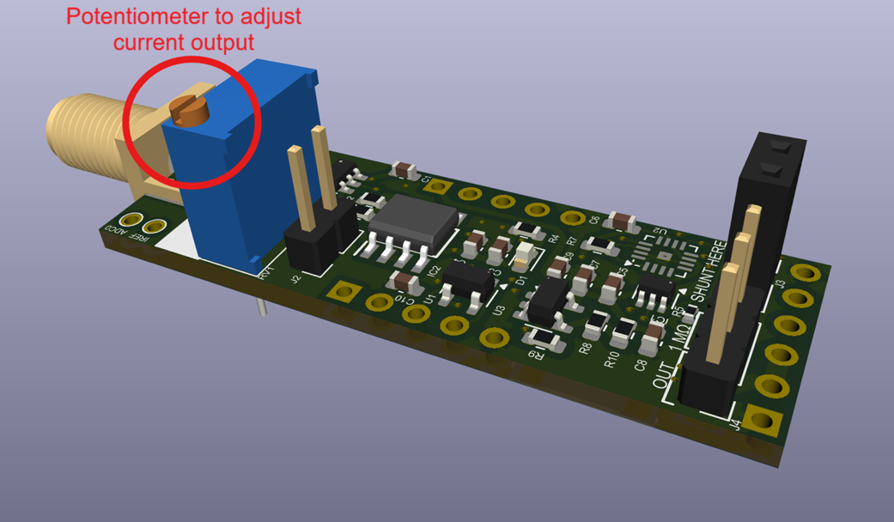
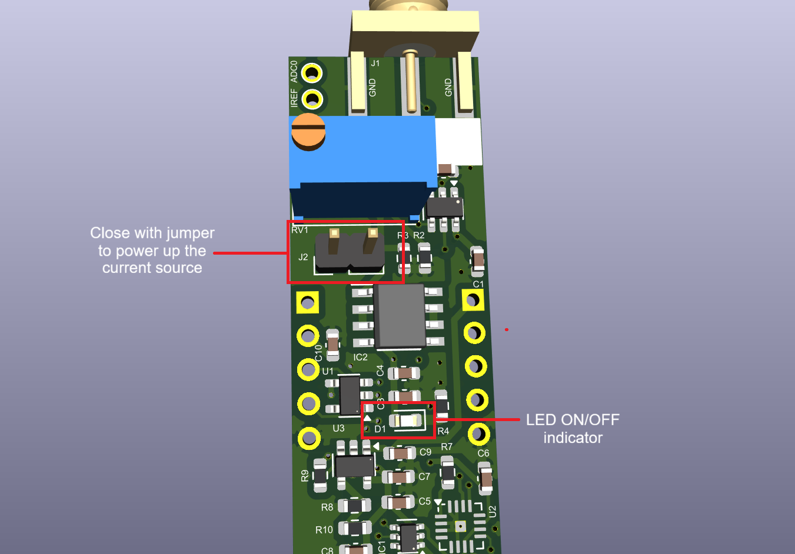
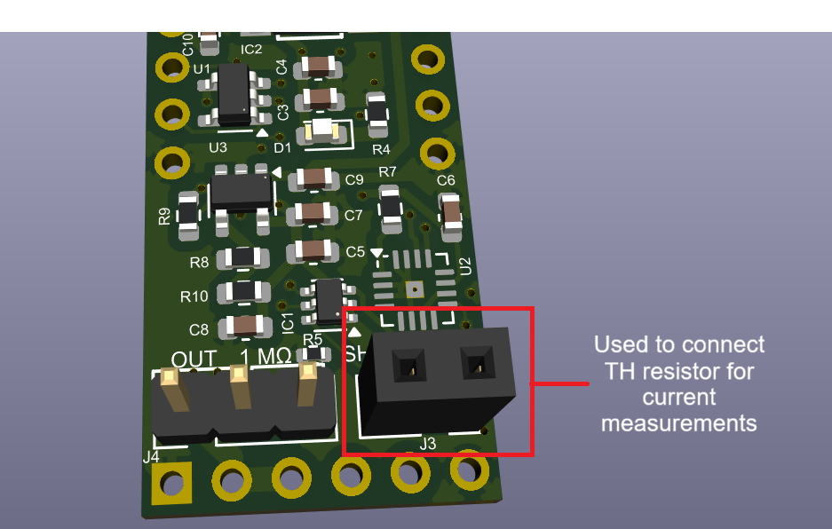

# Overview

This chewing gum board is designed to be a current source and intended for connection to the main board through the male pin headers to both sides. It can produce a current output from 600 nA to 1.4 uA, usually as an external bias current to the analog blocks in the test chip.
# User guide and programmability

It is a single-channel current source based on the LM334 IC. It is capable of outputting from 600 nA to 1.4 uA using the resistor network, with a potentiometer that allows to adjust the output within this range. (Note that this output current range can be extended up to 10 mA by changing the values of resistors R2, R3 and RV1, check schematic and datasheet).

The LM334 is powered by 3.3 V, however, unless the J2 jumper is connected, the current source IC will not be powered. Once it is powered-up by connecting the jumper, the LED should turn on.

Similar to other chewing gum boards (e.g., see _CurrentMeasurementSupply_), the current source board can be use to obtain a reading of the output current. All the current measurement circuits are kept unchanged and therefore can be used in the same way by employing shunt resistors + the ADC reading.

Female pin header J3 can be used to connect a through-hole resistor for current measurement. This allows for quicker replacement of the shunt resistor values, as opposed to the SMD alternatives.

The "IREF" test point next to the SMA connector can also be used to measure the voltage at the output of the current source. 

## Use of the DAC and EN pins

In this board, both the external EN pin to the board and the DAC are kept unused. This is because the current source IC is not compatible with either of these functions. However, the DAC is kept in the board for a possible future use.