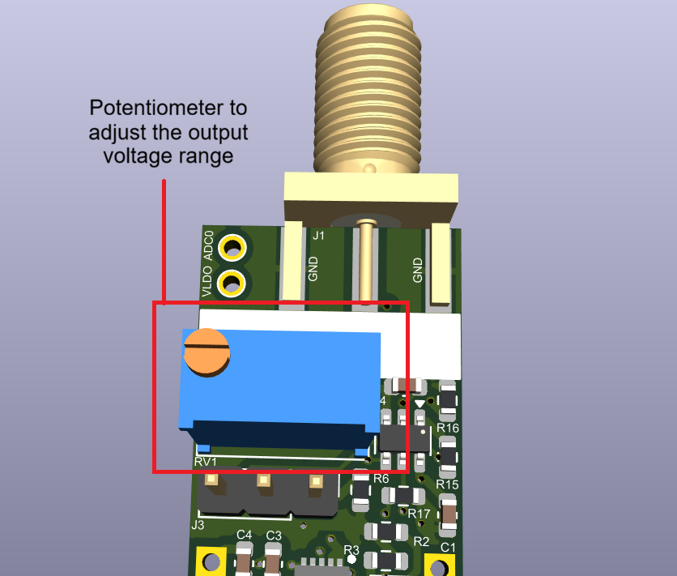
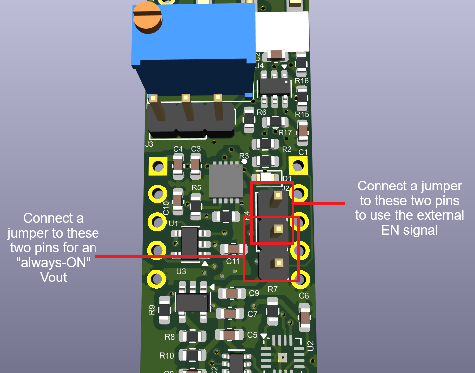
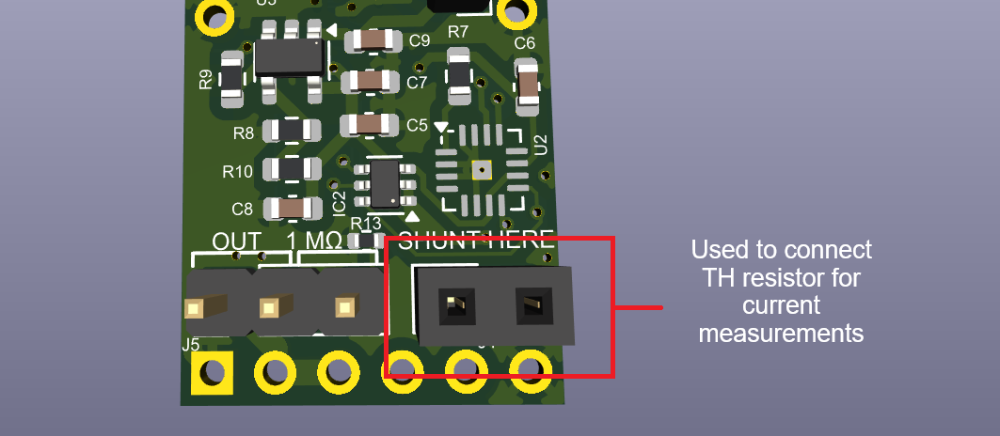
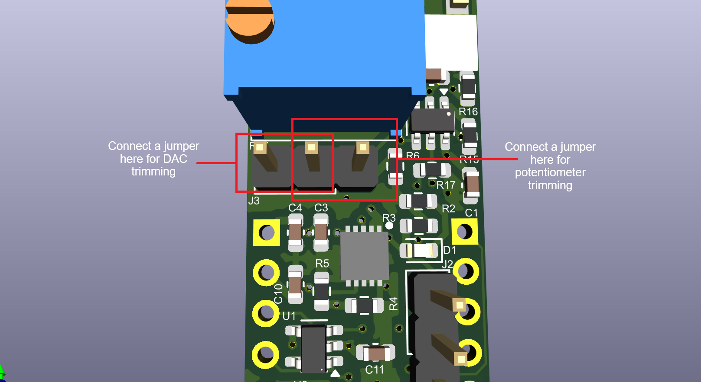

# Overview

This chewing gum board is designed to be an extended-range voltage supply + current measurement circuit, intended for connection to the main board through the male pin headers to both sides. It can produce a voltage output from 0 to 5 V approximately, with currents of up to 1 A (@nominal voltage, check datasheet).
# User guide and programmability

This chewing gum board is an adaptation of the _CurrentMeasurementSupply_ chewing gum and as such can be used in a similar way, the main difference being the wider supply voltage range. This Extended Range version, however, supports only a single voltage output ("A").

It is based on the TPS7A9401 IC. The output voltage is defined via a resistor network, with a potentiometer soldered to the board that allows to manually modify the output within this range.

The TPS7A9401 is always ON and will operate when the EN pin is high. Either the external EN input, or the internal supply signal can be used to set the EN pin. This can be selected through the J2 jumper.

Similar to the _CurrentMeasurementSupply_ chewing gum board, this extended range version can also be use to obtain a reading of the output current. All the current measurement circuits are kept unchanged and therefore can be used in the same way by employing shunt resistors + the ADC reading. 

Female pin header J3 can be used to connect a through-hole resistor for current measurement. This allows for quicker replacement of the shunt resistor values, as opposed to the SMD alternatives.

The "VLDO" test point next to the SMA connector can also be used to measure the output voltage.

## DAC programming

Besides using the potentiometer for trimming, the output voltage can also be adjusted by changing the input to the DAC. For this operation, however, resistors R15 and R16 need to be selected for this by carefully checking the possible voltage range with the datasheet.

Jumper J3 can be used to set potentiometer or DAC trimming.

## Simulations

A macromodel of the TPS7A9401, together with a simplified circuit modeling its behavior in this board has been included. The simulation can be run using TINA-TI. This allows, for example, to change resistors and verify the output voltage of the TPS7A9401, as well as the output current when simulating with a load.